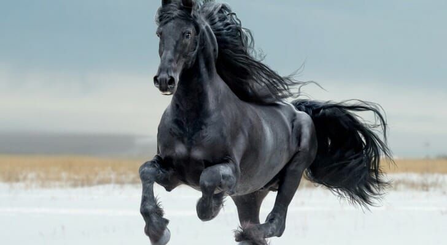
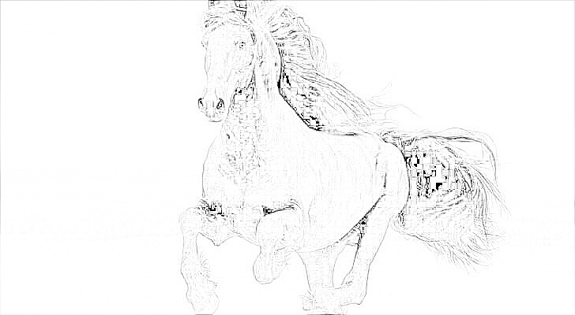
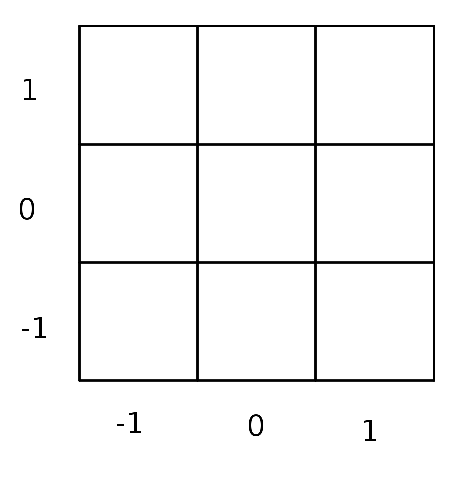
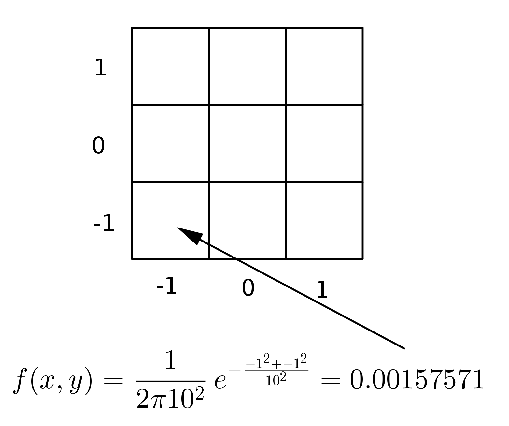
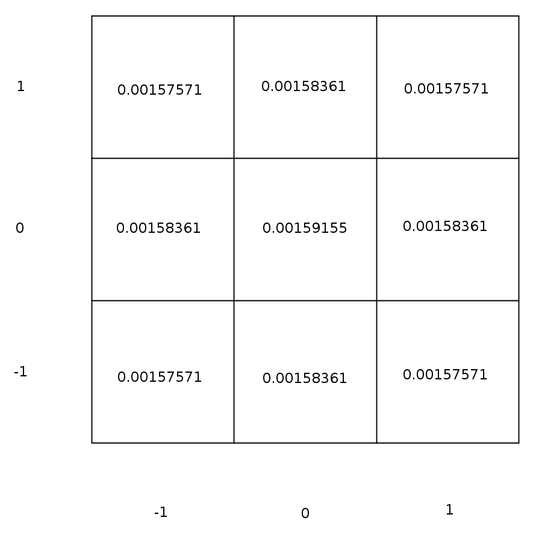

# photo_sketching-
We are going to see how to change this image
<br />

<br />
into this image 
<br />

<br />

## Step 1: convert the image into grayscale
<br />
Two methods are used: 
<br />
<br />
1- Average method: 
<br />
In this method, the average of the three channels is taken. 
<br />
gray_image = (R+G+B)/3
<br />

```

for i in range(image.shape[0]):
    for j in range(image.shape[1]):
      gray_image[i,j] =  np.clip( (image[i,j,0] + image[i,j,1] + image[i,j,2] )/3, 0, 255)      
```
<br />
<br />

2- Luminosity method: 
<br />
In this method, a weighted average is taken. 0.07 for the red channel, 0.72 for the green channel, and 0.21 for the blue channel. 
<br />
gray_image = 0.07R + 0.72G + 0.21B
<br />
```
for i in range(image.shape[0]):
    for j in range(image.shape[1]):
      gray_image[i,j] = np.clip(0.07 * image[i,j,0]  + 0.72 * image[i,j,1] + 0.21 * image[i,j,2], 0, 255)
```
<br />
<br />

Experiment with both methods to see the difference. The average method treats the three channels equally but the human eyeballs react differently to each of them. Furthermore, the wavelength of the colors differs. For the red color, it is 650-700 nm. For the green, it is 550 nm, and for the blue, it is 450 nm. As you will notice, the output image of the average method is relatively darker because the contribution of the colors is not equal due to the difference in the wavelengths. The luminosity method takes care of the problem. 

<br />
<br />
## Step 2: Blur the gray image:

<br />
<br />
In this code, a gaussian filter is used to blur the inverted image. The function _initialize_kernel_ initializes a gaussian filter and the function _conv2d_ applies the filer on the image. 
<br />

The following figures explain how a 3x3 filter is created.  First, construct the mesh as follows:

<br />

<br />


Then apply the gaussian function (ex.: with sigma=10) as follows:
<br />

<br />

After you complete the calculation for all the values of x and y, you get the following:
<br />

<br />

The final step is to normalize the above filter. 
<br />

To get the blurred image, we convolve the gray image with the gaussian filter. 


<br />


## Step 3: 

Divide the gray image by the blured image to get the final result. 


